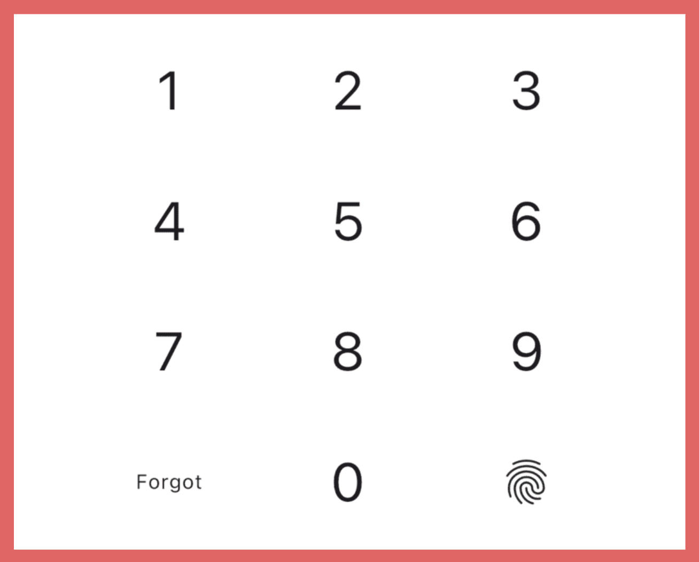
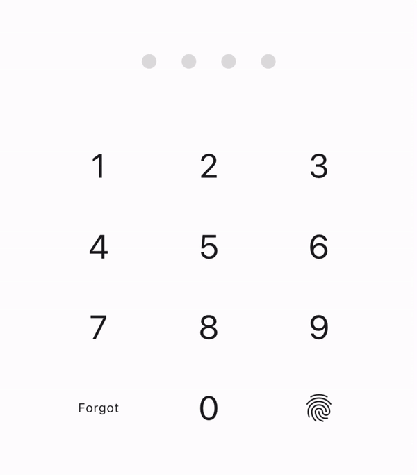

The **pin_ui** package is responsible for fast layout of advanced PIN code related
screens in Flutter applications. It provides 2 core widgets:

1) **Pinpad.** Highly customizable keyboard for entering PIN code.
2) **Pin Indicator.** Obscured field for visualizing entered PIN code status
   with lots of pre-made animations to choose from.

❗See also: [**pin**](https://pub.dev/packages/pin). 
**pin** is a package focused on PIN code's backend part. It fully covers all
the necessary logic of storing, updating, validating PIN, setting and handling
timeouts, calling biometrics, and some other options for better user experience. 
**pin_ui + pin** are designed to work together. Combining these two may save you
days of development and the result will be already perfect even out of the box.

## Pinpad

**Pinpad** is a numeric keyboard with 2 extra key slots. Usually they place
*"Forgot PIN"* and *Biometrics* buttons there.

### Customization

- 0-9 keys can be decorated with Flutter's `BoxDecoration` class to change its
  appearance: background color, border radius, border, shadows, etc. There are 3 states:
  default, pressed and disabled. Each is customizable on its own, so you can make
  them look different. Provide `keyDefaultDecoration`, `keyPressedDecoration` and
  `keyDisabledDecoration` to set it in a way you prefer.
- 0-9 keys has a `TextStyle` property. There are also 3 states: default, pressed
  and disabled. Set `keyDefaultTextStyle`, `keyPressedTextStyle` and `keyDisabledTextStyle`
  to style digits inside the keys.
- Resize keys with `keyHeight` and `keyWidth`.
- Spacing between keys can be changed with `horizontalSpacing` and `verticalSpacing`
  properties.
- You can disable or make pinpad invisible by setting `enabled` and `isVisible`.
  Making it invisible will not change actual size of the keyboard.
- Vibration can be enabled with `vibrationEnabled` property. It will make a slight
  vibration feedback when a key is pressed.
- To add extra keys to the left and right of 0 key, provide `leftExtraKey` and `rightExtraKey`.
  These parameters have `PinpadExtraKey` type. It is a wrapper above your child widget
  where you add onTap callback. Child can be any widget, but also you can use
  `PinpadKey` or `PinpadTextKey` provided by this package to make all buttons look
  the same.

## Pin Indicator

**Pin Indicator** is a widget that provides visual representation of PIN code:
how many digits are entered, is there an error, was an attempt successful and so on. 
The simplest variants of Pin Indicator is a line of colored dots or obscured stars.

### Customization

There are 2 widgets to layout Pin Indicator in your apps: `PinIndicator` and
`PinIndicatorBuilder`. Mostly they have the same set of parameters, the main
difference is that by using Builder version you can provide any widgets as items.
So it more customizable. If you don't need this customization level, just use
`PinIndicator`. It provides simple items that can be decorated with Flutter's
`BoxDecoration`.

**Items** inside both `PinIndicator` and `PinIndicatorBuilder` have 4 states:

- **Default.** To represent not entered PIN code digits.
- **Input.** To represent entered PIN code digits.
- **Error.** When user has entered wrong PIN code.
- **Success.** When user has entered correct PIN code.

So there are 4 different parameters to customize your Pin Indicator. 
For **PinIndicatorBuilder** 4 required parameters: `defaultItemBuilder`,
`inputItemBuilder`, `errorItemBuilder` and `successItemBuilder`. 
For **PinIndicator**: `defaultDecoration`, `inputDecoration`,
`errorDecoration` and `successDecoration`. These parameters are not required.
If not provided, pre-made decorations will be used instead. 

**Length** (number of digits in PIN code) can be anything starting from 3,
but usually it is 4, 5 or 6. 
To set it, use `length` parameter.

To set number on already entered digits for Pin Indicator use `currentLength`
parameter.

To set **error** or **success** state for Pin Indicator provide `isError` or `isSuccess`
values.

To change spacing between items, set `spacing` parameter.

When using `PinIndicator` you can provide `size` parameter to resize your items.

### Animating

Animations are one of the core features of **pin_ui** package. It contains lots of
pre-made animations for several scenarios when user interact with your app. Pin
Indicator can be animated in such ways:

- **Input.** Animate input when user enters a digit of PIN code.
- **Loading.** Animate loading when you need to hide long-lasting async operation
  or to make animations flow more smooth and obvious to user.
- **Success.** Animate success when user enters correct PIN code to also hide
  long-lasting async operation after loading animation. And to demonstrate user
  that they entered correct PIN code and no more actions required from their side.
- **Error.** Animate error when user entered wrong PIN code to show them that
  entered PIN code is incorrect.
- **Clear.** Animate clear when user clears entire PIN code at once if there are
  such function or when other logic triggers clearing of entire PIN code, such
  as tapping "Forget PIN" button or requesting biometrics.
- **Erase.** Animate erase when user erases a digit from PIN code.
- **Idle.** Animate idle when user was inactive for a while to instigate them for
  an action and show that app is still alive and waits for an action from user's
  side.

Each of these animation types has a set of already implemented animations to
chose from.

[//]: # (TODO: table of animations)

Currently, there are no ability to customize them or add your own via package API.
You can
read [how to add a new animation or customize an existing one](#adding-new-animations-or-customizing-existing-ones)
in case no one of them is suitable for you for some reason.

Animations are called via `PinIndicatorAnimationController` provided by this package.
Associate a controller with `PinIndicator` or `PinIndicatorBuilder` by passing it
in `controller` parameter. After that you can call animation methods and Indicator
will be animated in a way you said it to.

You may also want to update your UI when animations starts or ends.
This can be done by listening to controller via `ValueListenableBuilder`. 
Such opportunity may be useful in some cases. For example, if you want to
disable `Pinpad` or make it invisible when **loading** or **success** animation
are in progress to show user that something is happening in background and no
more actions required. Or if you want to update `Scaffold` background color
depending on current animation.

## Usage

## Additional information

### Adding new animations or customizing existing ones

**pin_ui** package is designed to be easily extendable in terms of adding
new animations, but currently there are no such API provided. But you can still
add own animations by
forking [source code repository of this package](https://github.com/AndreySosnovyy/flutter_pin_code_ui),
suggesting something in [issue](https://github.com/AndreySosnovyy/flutter_pin_code_ui/issues)
or [pull request](https://github.com/AndreySosnovyy/flutter_pin_code_ui/pulls).

Before adding a new animation read an [instruction](add_new_animation.md) on how to do it correctly.

